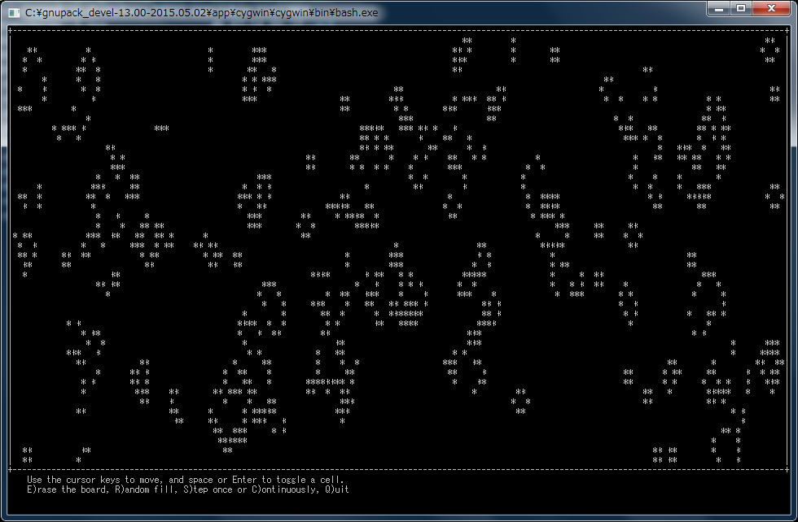

# _curses module for Python3.x(win64)

### requirements
SCons-2.3.x (Python2.7, for build SConstruct)

Python3.4.x (for running life.py)

VisualStudio 2010 or later (for compile)

Cygwin (for make, curl, patch)

#### how to build
make .. build _curses.pyd (for Python3.4 / win64)

make life .. run the life game using Python-Curses

### notes
PDCursesのWIN実装はsetuptermが必ず失敗するのでコメントアウトしてあります。(modify.patch)

SConstructのTARGET_ARCH=を消せばx86でも動作するかも（未確認）

### externals
Python-3.4.2.tar.xz .. https://www.python.org/downloads/release/python-343/

PDCurses-PDCurses_3_4.tar.gz .. https://github.com/wmcbrine/PDCurses/releases

life.py .. http://svn.python.org/projects/python/branches/dmalcolm-ast-optimization-branch/Demo/curses/life.py
